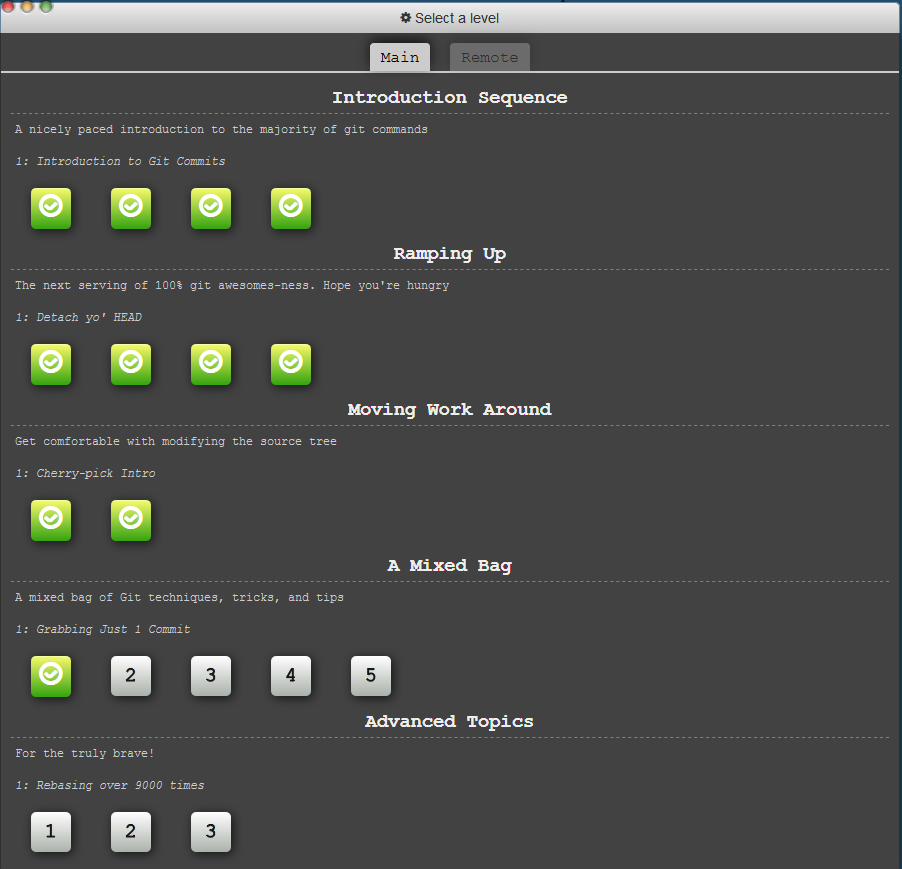
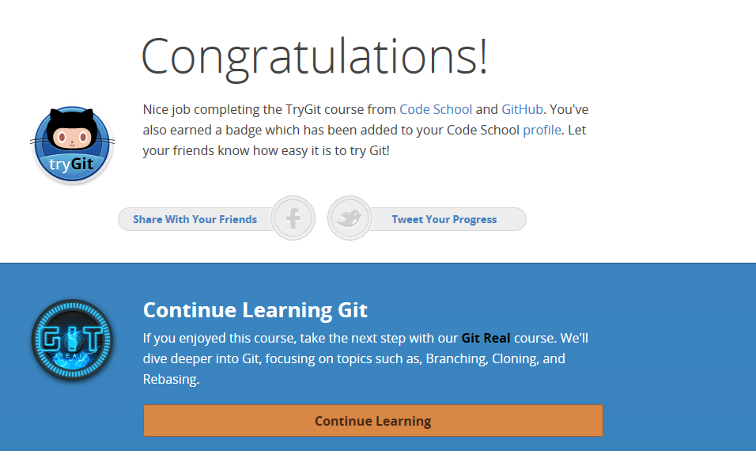
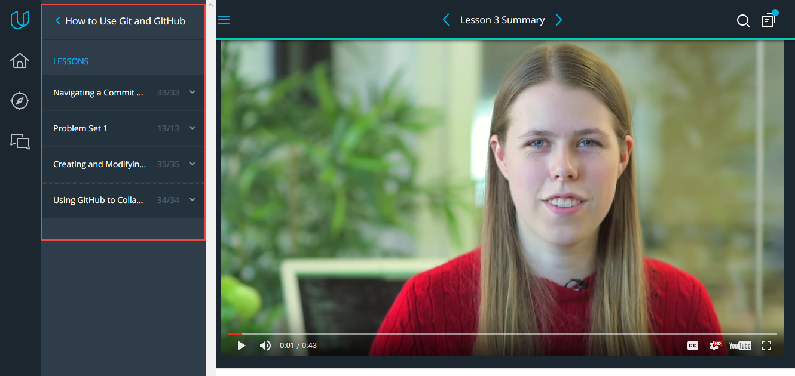

# Task 0 (get familiar with Git and Github)
## main part
- http://learngitbranching.js.org/

## additional part
* try.github.io

* sixrevisions.com/web-development/git-tips/
  - http://rogerdudler.github.io/git-guide/
  - http://rypress.com/tutorials/git/introduction  for me it's best tutorial
- also http://marklodato.github.io/visual-git-guide/index-en.html  also good for.

*  How to use Git and Github

* [Markdown Commonmark tutorial](http://commonmark.org/help/tutorial/)
