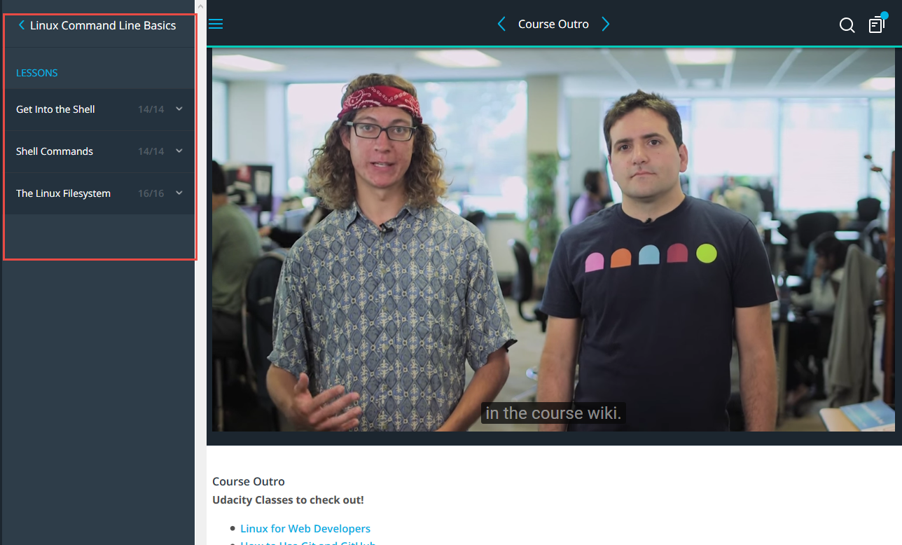
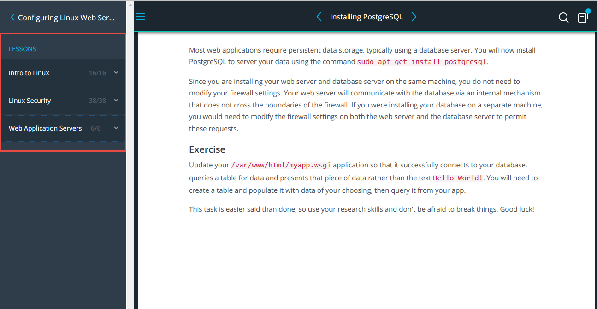

# Task 1 (Linux, and network basics)
## main part
- Continue Linux Command Line Basics

- Configuring Linux Web Servers

- Networking for Web Developers

## additional part
Those articles were studied
* HTTP: The Protocol Every Web Developer Must Know - Part 1

* HTTP: The Protocol Every Web Developer Must Know - Part 2
