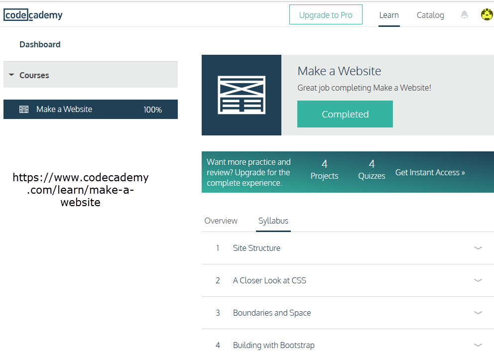

# Task 2 (HTML and CSS basics + JS basics)
## main part

## additional part
 Tasks from
 - Freecodecamp from zero to front-end hero part 1
  - [Introduction to HTML](https://developer.mozilla.org/en-US/docs/Web/Guide/HTML/Introduction)
  - 
  - 
 - Freecodecamp from zero to front-end hero part 2
