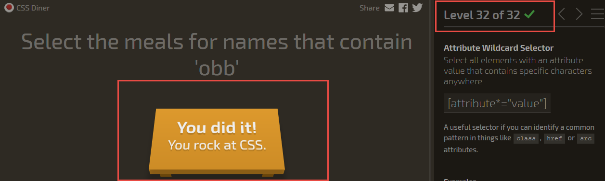

# Task 2 (HTML and CSS basics + JS basics)
## main part
- [Freecodecamp account](https://www.freecodecamp.com/m-vv)
- Trivial Quiz
   - [GitHub repo](https://github.com/m-vv/TriviaQuizForKottans)
   - [pen in codepen.io ](http://codepen.io/m-vv/full/zNzepP/)

## additional part
 Tasks from
 - Freecodecamp from zero to front-end hero part 1
  - [Introduction to HTML](https://developer.mozilla.org/en-US/docs/Web/Guide/HTML/Introduction)
  - [Make a Website](https://www.codecademy.com/learn/make-a-website)
  
  - [ CSS Diner] (http://flukeout.github.io/)
  
 - Freecodecamp from zero to front-end hero part 2
